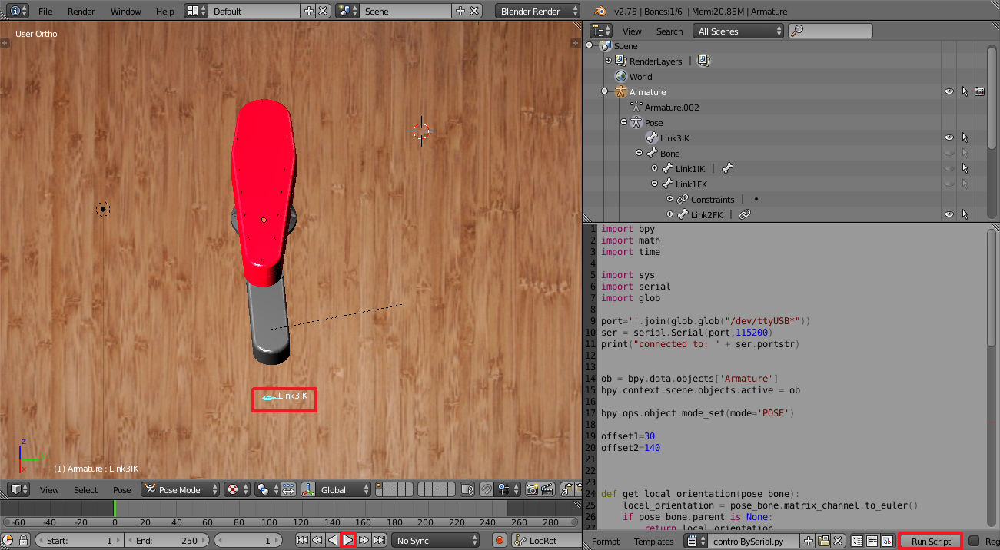

# BlenderController

 

This repo shows how to control a robot from blender using python.
To execute the controller first upload the arduino code into the board. Then in the blender file, press on "Run Script", then the play icon and finally hover the mouse over the control bone and press the "G" key.
 

